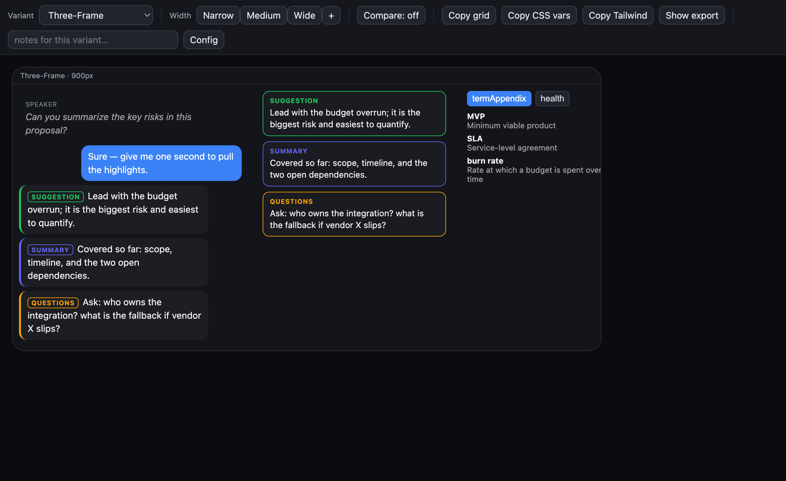
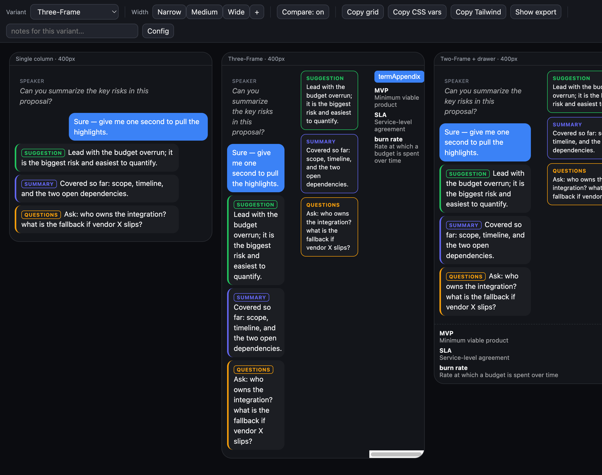
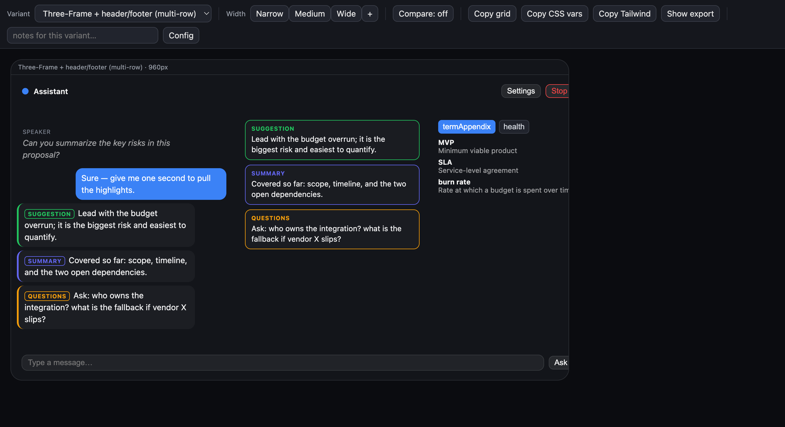

# Layout Lab

A cross-project, **single-file, no-build** tool for laying out and **comparing
candidate UI layouts** — on real content and real design tokens — *before* you
implement them in app code.

It deliberately **exports the layout contract** (the resolved CSS-Grid template +
your design tokens as CSS custom properties and a Tailwind theme), **not finished
components**. That's the part that reliably transfers to a React/Tailwind/Electron
implementation; the rest you write by hand from a decision you've already made
visually.




Multi-row grids let you mock real app **chrome** (header/toolbar/footer) around the
content, with draggable column dividers:



## Why

Every "draw → get code" tool that tries to emit production components disappoints
(the output "needs substantial cleanup"). Layout Lab stays at the altitude that
actually transfers: **grid template + tokens.** You use it to *decide* a layout on
realistic content, copy the contract, and move on — the markup is throwaway on
purpose.

## Quick start

No install, no build. Either:

- **Open directly:** open `layout-lab.html` in a browser. It loads the default
  (`configs/demo.config.js`).
- **Serve (recommended for `?config=` and clean reloads):**
  ```sh
  npm run serve   # python3 -m http.server 8123
  # then open http://localhost:8123/layout-lab.html?config=configs/demo.config.js
  ```

Use the toolbar to switch variants, set width presets, drag the column handles,
toggle compare mode, jot per-variant notes, and copy the exports (grid / CSS vars
/ Tailwind).

## Use it on your project

Layout Lab is **one engine** (`layout-lab.html` + `layout-core.js`) driven by a
per-project config. **To use it on a new project, write one `*.config.js` file —
the engine never changes.**

**Where your config lives:** keep each project's config **and** its rendered outputs
(PNGs / saved states) **inside that project** — e.g. a `ui-reference/` (or `ui-lab/`)
folder — not in this repo. Point the tool at it by serving a common parent and using
`?config=`:

```sh
cd ~/Projects && python3 -m http.server 8123
# open: http://localhost:8123/layout-lab/layout-lab.html?config=/yourapp/ui-reference/yourapp.config.js
```

This repo stays generic (engine + template + demo only). See
[`configs/README.md`](configs/README.md) for the full contract. In short, a config
supplies four things:

- `tokens` — flat groups (`color`, `space`, `radius`, …) → become `--group-key`
  CSS vars and the Tailwind/CSS exports.
- `renderers` — `{ name: (seed, tokens) => htmlString }`; pure, no DOM.
- `seed` — real sample data passed to your renderers.
- `variants` — candidate layouts (`{ id, name, grid:{columns, areas}, panes }`).

`configs/demo.config.js` is a complete worked example (a generic assistant-overlay
demo); `configs/_template.config.js` is a blank to copy.

## Architecture

- `layout-core.js` — all pure logic (token exporters, grid math, total-preserving
  resize clamp, URL-state codec, config validation). UMD-lite: it's a classic
  browser `<script>` **and** a CommonJS module, so the same file runs in the page
  and is unit-tested in Node — no build step.
- `layout-lab.html` — the engine UI: config loading, rendering, pointer-drag pane
  resize (CSS Grid, px/`minmax` tracks, min-clamped), container-query pane
  internals, compare mode, frame toggles, localStorage + URL-hash persistence,
  and the export panel.
- `configs/` — per-project configs (the only thing that changes between projects).
- `test/` — Node test-runner unit tests.
- `docs/` — validation screenshots.

## Tests

```sh
npm test    # node --test test/*.test.mjs  (Node 20+)
```

23 unit tests cover the pure core and validate the example config. The
DOM/interaction layer is validated in-browser (drag rewrites the grid, exports
match the live layout, container queries reflow on pane width, toggles + compare).

## Status

v0.1.0 — built and live-validated. Standalone; **zero runtime dependencies.**
